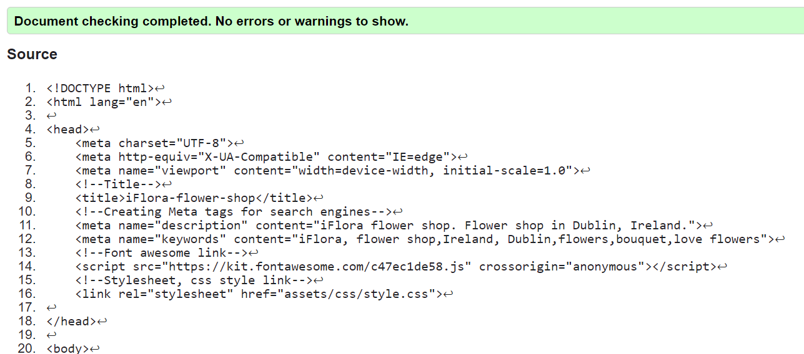

# iFlora Flower Shop Website

Welcome to the iFlora Flower Shop website's README file. This document provides an overview of the website, detailing its structure, features, and how to navigate through the site.

## Website Structure

The iFlora website is structured into several main sections:

1. **Header**: Contains the navigation bar with links to Home, About Us, Flower Catalog, Review, and Contact sections.
2. **Home Section**: Features an engaging welcome message and introduces the concept of the flower shop.

3. **About Us Section**: Offers insights into the shop's services, values, and unique selling points, including a video presentation.

4. **Icons Section**: Highlights special offers and guarantees, like discounts, freshness of flowers, and delivery details.

5. **Flower Catalog Section**: Displays a variety of flower bouquets with images, names, and prices.

6. **Review Section**: Showcases customer reviews and ratings.

7. **Contact Section**: Provides a form for visitors to contact the shop, along with a decorative image.

8. **Footer**: Contains contact information and location details.

## Features

- **Responsive Design**: The website is designed to be responsive, ensuring a good user experience across different devices.

1. Navigation toogle:

2. For Large screens:

3. For small screens:

- **Video Content**: Engaging video content in the About Us section.

- **Interactive Elements**: The site includes interactive elements like a checkbox for menu toggling, icons, and form inputs.

- **Rich Media**: High-quality images of flower bouquets and customer reviews enhance the visual appeal.
- **SEO Optimization**: Meta tags are included for better search engine visibility.

## Navigation

Users can easily navigate through the site using the top navigation bar. Each section is clearly marked, and the layout is intuitive.

## Technical Details

- **HTML and CSS**: The site is built using HTML and CSS, ensuring a lightweight and fast-loading experience.
- **Font Awesome Icons**: Icons from Font Awesome are used to add visual elements to the site.
- **External CSS**: Styles are defined in an external stylesheet, 'style.css'.

### Features Left to Implement

While the iFlora flower shop website is already feature-rich and user-friendly, there are several additional features that could enhance the user experience and functionality in the future:

1. **Online Payment Integration**:  Implementing a secure online payment system for customers to make purchases directly on the website.
2. **Live Chat Support**:  Adding a live chat feature for real-time customer support and inquiries.
3. **User Account Creation**: Allowing customers to create their own accounts to track orders,save favorite items, and receive personalized recommendations.

4. **Expanded Delivery Options**: Offering  more varied  delivery options, including international shipping.

## Testing

The iFlora flower shop website has been testing for:

### Functional Testing

- **Navigation Links**: Tested all navigation links in the header to ensure they smoothly scroll to the corresponding sections.
- **Contact Form**: Ensured the contact form correctly validates input fields and submits data.
- **Video Playback**: Verified that the video in the About Us section plays correctly, loops, and is muted by default.

### Usability Testing

- **Responsive Design**: Tested the website on multiple devices (smartphones, tablets, laptops) to ensure the design is responsive and elements adjust appropriately to different screen sizes.

### Compatibility Testing

- **Cross-Browser Compatibility**: Tested the website on various browsers including Chrome, Microsoft Edge, Safari, to ensure consistent behavior and appearance.
- **Mobile Compatibility**: Ensured that the website is fully functional and visually appealing on different mobile devices and operating systems.

### Validator Testing

#### HTML,CSS

- **W3C Markup Validation**: The HTML code of the iFlora website was tested using the W3C Markup Validation Service. This process checks the markup validity of web documents in HTML and CSS etc.
- **Error Checking**: All identified errors and warnings were carefully reviewed and corrected. Common issues often involve missing closing tags, improperly nested elements, or missing attributes.
- **Semantic Structure**: Ensured that the HTML structure is semantically correct, which includes the proper use of header tags, paragraphs, lists, and other HTML5 elements.

## Deployment

To deploy the Smart Home project, follow these steps:

1. Clone the repository to your local machine using the following command:

git clone <https://github.com/user/smart-home.git>

### Media

- The photos used for this site are from  www.pixabay.com and <https://www.istockphoto.com/> sites.
